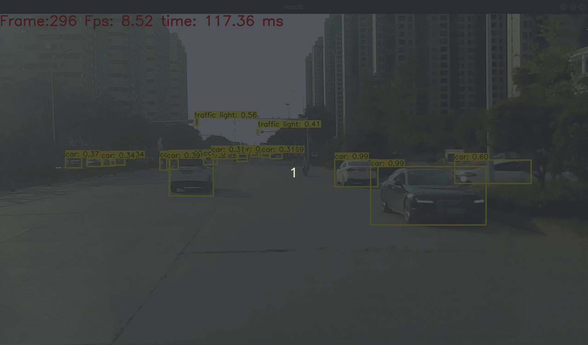
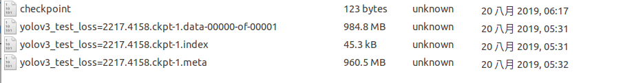

yolov3_tensorflow
===========================================   
# 目录
[TOC]

# 简介   
yolo_v3 的tensorflow版本，来源于[YunYang1994 tensorflow-yolov3](https://github.com/YunYang1994/tensorflow-yolov3),在此基础上添加注释，以方便理解。   
      
关于网络结构部分，可以参照文章[YOLO v3 网络结构分析](https://blog.csdn.net/leonardohaig/article/details/90346325),建议对yolo的网络结构有一定理解。    
  
# 快速入门
1.下载代码
```
git clone https://github.com/leonardohaig/yolov3_tensorflow.git
```
2.下载已经转换好的`yolov3_coco.pb`文件，并放在`yolov3_tensorflow/`目录下，和`train.py`同级，文件下载链接:https://pan.baidu.com/s/1ACVz84XxPIYcgpCNl9zJSg 提取码:ewku     
3.运行视频示例:   
3.1修改`video_demo.py`文件中`video_path`路径指向视频文件路径，如果为摄像头，则修改为摄像头设备索引，如0,1等;      
3.2运行代码`python3 video_demo.py`,即可看到结果画面,如下所示：  
   

# 训练自己的数据集    
以训练`images`下的raccoon为例  

**Note：该项中的操作步骤1/2所需的文件已经制作完成，可以略过**    
    
1.准备两份标签文件，格式如下：
```
xxx/xxx.jpg 18.19,6.32,424.13,421.83,20 323.86,2.65,640.0,421.94,20 
xxx/xxx.jpg 48,240,195,371,11 8,12,352,498,14
# image_path x_min, y_min, x_max, y_max, class_id  x_min, y_min ,..., class_id 
```
每一行表示图像路径，矩形框的左上顶点、右下顶点坐标，该矩形框类别  矩形框的左上顶点、右下顶点坐标，该矩形框类别  ....
这两份文件分别为训练集和验证集。在该项目中已制作好，位于`data/classes`文件夹中，分别为`data/classes/train_yoloTF.txt`和`test_yoloTF.txt`   
   
2.准备存放目标类别名称的文件，格式如下：   
```  
person
bicycle
car
...
toothbrush
```
每一行表示目标类别名称。    
该项目中，文件为`data/classes/raccoon.names`       
     
3.修改配置  
3.1 修改`core/config.py`文件`__C.YOLO.CLASSES`为    
`__C.YOLO.CLASSES                = './data/classes/raccoon.names'`    
3.2 训练集标签和验证集标签已经在代码中更改完毕，无需修改    
3.3 根据个人机器情况，修改`__C.TRAIN.BATCH_SIZE`和`__C.TEST.BATCH_SIZE`为合适的大小   
4.开始训练   
`python3 train.py`   
5.训练日志存放`data/log`目录下，可以通过`tensorboard`查看训练过程，训练过程中会在`checkpoint`目录下得到如下类似文件   
    
6.将训练结果转换为`.pb`文件。   
修改`freeze_graph.py`中`ckpt_file`指向`.ckpt`训练结果，如：`ckpt_file='./checkpoint/yolov3_test_loss=2400.3652.ckpt-1'`  
然后执行`python3 freeze_graph.py`即可在根目录下得到转换后的`.pb`文件；最后利用`video_demo.py'来验证训练效果    
7.如果训练过程在google colab上完成，将训练后的模型保存到自己电脑上后，需要保证自己电脑tensorflow版本和google colab上tensorflow(1.14.0)版本一致 